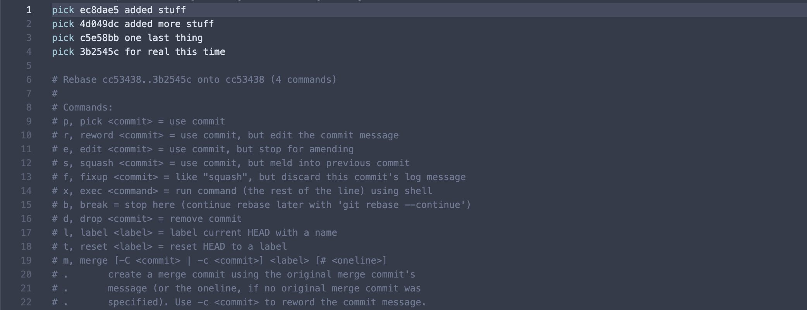
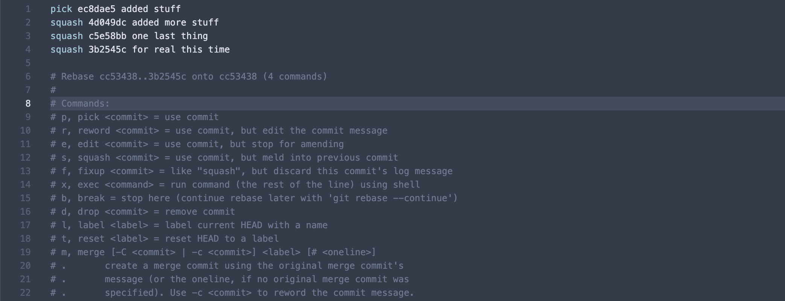

# Project 2: Analysis of Twitter Data

## Work Flow
Recommended work flow for code changes is as follows:

From **main** branch run

`git pull`

Create new feature branch with

`git checkout -b <my_branchname-developer_alias>`

Make code changes and then...

```
git add <my_changes>
git commit -m 'added my changes'
git checkout main
git pull
git checkout <my_branchname...>
git rebase main -i
```
> Squash commits and resolve merge conflicts as needed. Refer to the respective sections below for addition information

```
git checkout main
git push origin <my_branchname...>
```
Notify team member of pending review


## Squashing Commits
We will want to squash commits in order to keep the commit history streamlined.  When you run `git rebase main -i` a panel in your default text editor will open. Refer to the image below.
> 
If the text within the panel appears similar to the image above with multiple "pick" lines, change all but one line to "squash"

It should now resemble the image below. Save and close the panel in order to continue the rebase process. 
> 

## Resolving Merge Conflicts
In general, if resolving merge conflicts is not going well, you can run `git rebase --abort` any time during the process to undo your recent changes and start over. The following steps are a high-level outline and may vary depending on your unique situation.

- Open the project in your preferred text editor
- Lines or blocks of code that contain conflicts should be highlighted
- Options to accept current change, accept incoming change, accept both changes, and compare changes should be available
- Select the appropriate change. If uncertain, consult with a team member
- Save and run `git add <my_changes>` (committing is not necessary)
- It is good practice to check other files you have altered to see if any other conflicts exist
- run `git rebase --continue` to complete the rebase process

## Conflict Resolution Plan
In the unlikely event that team members encounter an unresolvable issue between themselves, a knowledgeable, neutral third-party will be consulted to aid in resolution.  However, team members are encouraged to resolve all issues internally.   
